# Easylauncher gradle plugin for Android

[](https://codecov.io/gh/usefulness/easylauncher-gradle-plugin)
&nbsp;[](https://github.com/usefulness/easylauncher-gradle-plugin/actions)
&nbsp;[](https://ktlint.github.io/)

[](https://plugins.gradle.org/search?term=com.starter)

Modify the launcher icon of each of your app-variants using simple Gradle rules. Add ribbons of any color, overlay your own images, customize it according to your needs!

| Circle | RoundedRectangle | Teardrop |
| --- | --- | --- |
|  | 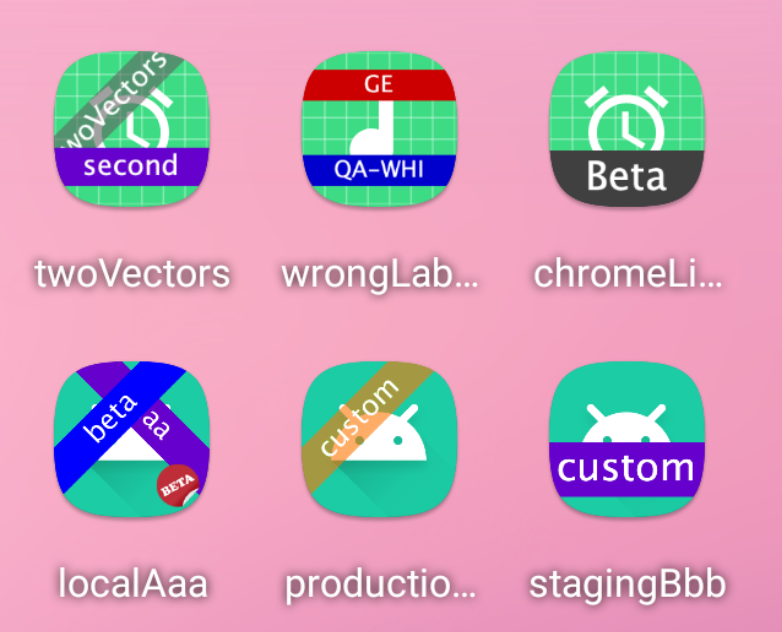 | 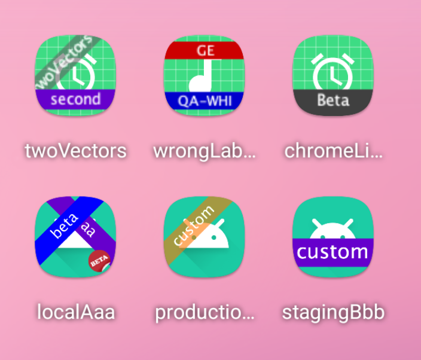 |

This library heavily relies on the original [Akaita's easylauncher](https://github.com/akaita/easylauncher-gradle-plugin) plugin, but introduces supports for modern build tools and **Vector icons**

## Usage

### Basic usage

```groovy
// in app/build.gradle
plugins {
    id "com.starter.easylauncher" version "${{version}}"
}
```
see [Gradle Plugin Portal] for the details  

<details>
  <summary>What do I do if I get `Could not resolve all artifacts` error?</summary>
    
  In some configurations a dependency resolution error might be thrown with a message: 
  > Could not find com.android.tools.build:gradle:4.0.1.`.
  
  As a solution add repository where the missing dependency resides:
  
  ```groovy
// in app/build.gradle
buildscript {
    repositories.google()
}
plugins {
    id "com.starter.easylauncher" version "${{version}}"
}
  ```
  
</details>  

### Advanced usage

You can customize the filters applied to each type, flavor and variant of your app.  

Imagine these are the type and flavors of your app:

```groovy
// in app/build.gradle
android {
    buildTypes {
        debug {
            //Debuggable, will get a default ribbon in the launcher icon
        }
        beta {
            //Debuggable, will get a default ribbon in the launcher icon
            debuggable true
        }
        canary {
            //Non-debuggable, will not get any default ribbon
            debuggable false
        }
        release {
            //Non-debuggable, will not get any default ribbon
        }
    }
    productFlavors {
        local {}
        qa {}
        staging {}
        production {}
    }
}
```


You could customize the plugin's behaviour like this: 


```groovy
easylauncher {
    defaultFlavorNaming = true // Use flavor name for default ribbon, instead of the type name
    
    productFlavors {
        local {}
        qa {
            // Add one more filter to all `qa` variants
            filters redRibbonFilter()
        }
        staging {}
        production {}
    }
    
    buildTypes {
        beta {
            // Add two more filters to all `beta` variants
            filters = [
                    customRibbon(ribbonColor: "#0000FF"),
                    overlayFilter(new File("example-custom/launcherOverlay/beta.png"))
            ]
        }
        canary {
            // Remove ALL filters to `canary` variants
            enable false
        }
        release {}
    }
    
    variants {
        productionDebug {
            // OVERRIDE all previous filters defined for `productionDebug` variant
            filters = orangeRibbonFilter("custom")
        }
    }
}
```

#### Providing Icon Names
By default, the plugin **automatically** discovers launcher icon and applies provided filters.  
It is possible to override that behavior and manually provide a set of   
Custom icon names, useful when defining multiple activity aliases, can be provided using `iconNames` property as follows:

```groovy
easylauncher {
    iconNames = ["@mipmap/custom_launcher_icon"] // optional, disables automatic launcher icon discovery

    buildTypes {
        beta {
            // icon names can also be overridden per-build variant (both buildType and productFlavor)
            iconNames = ["@mipmap/beta_launcher"]  
        }
    }
}
```  

## Available filters

## Overlay filter

| Command | Result |
| --- | --- |
| `overlayFilter(new File("example-custom/launcherOverlay/beta.png"))` | 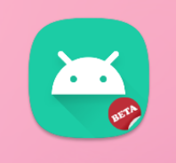 |

## Ribbon filters

| Filter | Command | Result |
| --- | --- | --- |
| Gray ribbon | `grayRibbonFilter()` | 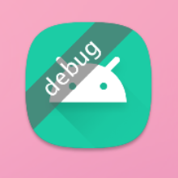 |
| Green ribbon | `greenRibbonFilter()` | 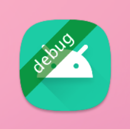 |
| Yellow ribbon | `yellowRibbonFilter()` | 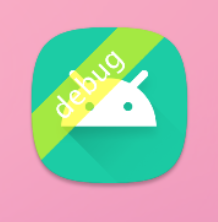 |
| Orange ribbon | `orangeRibbonFilter()` | 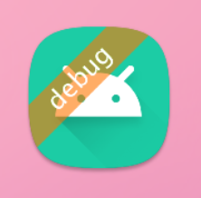 |
| Red ribbon | `redRibbonFilter()` | 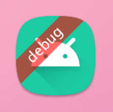 |
| Blue ribbon | `blueRibbonFilter()` | 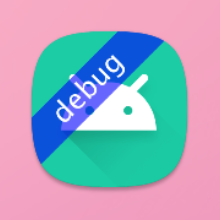 |

## Advanced Ribbon filter

| Description | Command | Result |
| --- | --- | --- |
| Custom background color  | `customRibbon(ribbonColor: "#6600CC")` | 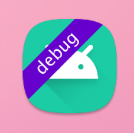 |
| Custom label | `customRibbon(label: "label", ribbonColor: "#DCDCDC")` | 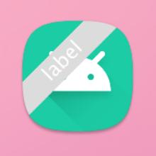 |
| Custom text color | `customRibbon(label: "label", ribbonColor: "#DCDCDC", labelColor: "#000000")` | 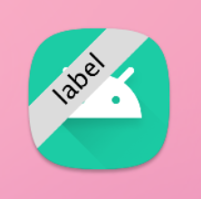 |
| Custom gravity - Top | `customRibbon(label: "custom", position: "top")` | 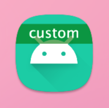 |
| Custom gravity - Bottom | `customRibbon(position: "bottom")` | 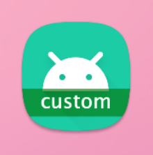 |
| Custom gravity - TopLeft | `customRibbon(position: "topLeft")` | 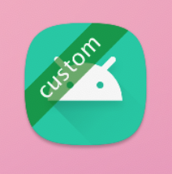 |
| Custom gravity - TopRight | `customRibbon(position: "topRight")` | 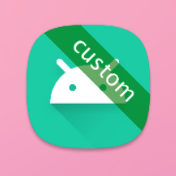 |
| Custom text size (relative to the icon size) | `customRibbon(position: "bottom", textSizeRatio: 0.2)` | 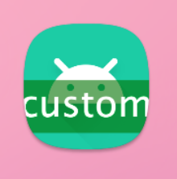 |
| Custom font (locally installed) | `customRibbon(position: "top", font: "ComicSansMs")` | 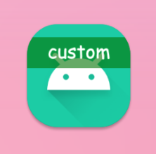 |
| Custom font (using font pack) | `customRibbon(position: "top", font: file("fonts/CustomFont.ttf"))` |  |

## Chrome-like filters

| Filter | Command | Result |
| --- | --- | --- |
| Default | `chromeLike()` | 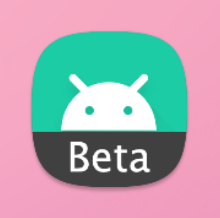 |
| Custom appearance | `chromeLike(label: "Custom", ribbonColor: "#FF00FF", labelColor: "#FFFFFF")` | 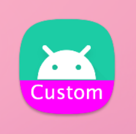 |
| Custom font (locally installed) | `chromeLike(label: "Custom", font: "ComicSansMS-Bold")` | 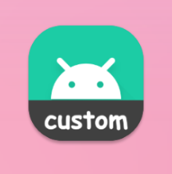 |

## Available options

 - `defaultFlavorNaming`: use _flavor_ name in default ribbons, instead of using _buildType_
 - `enable`: enable/disable **all** filters for a flavor/type/variant
 - `productFlavors`: define filters for flavors (will be **added** to filters defined for types)
 - `buildTypes`: define filters for types (will be **added** to filter defined for flavors)
 - `variants`: define filters for variants (will **override** any other filters)
 - `iconNames`: provides a list of icons which will have the filters applied

## Requirements
Minimal requirements for the plugin are: 
- Gradle: **6.1.1** 
- Android Gradle Plugin: **4.0.0**
- minSdkVersion: **21** _(theoretically there should be no lower boundary - it just hasn't been tested)_

## Project Structure

```
easylauncher/   - source code of Gradle plugin
sample/         - root directory of supported Android applications which serve as test projects
```

## Credits
Credits to [Akaita's easylauncher plugin](https://github.com/akaita/easylauncher-gradle-plugin) which this project heavily relies on


[Gradle Plugin Portal]: https://plugins.gradle.org/plugin/com.starter.easylauncher
